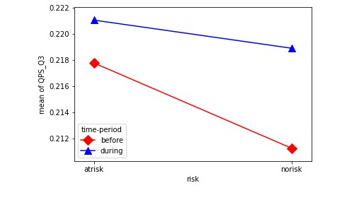
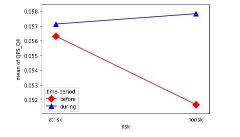

# Depression-Risk-Indicators (Covid-19)
- Research project by `Arpit Maheshwari` and `Dhruv Mahajan` under the able guidance of `Dr. Vinoo Alluri, Asst. Professor, Cognitive Science Lab, IIIT Hyderabad`.
 
## Research Objective
  We aim to unravel static and dynamic patterns existing in active listening behavior of individuals which may act as indicators of risk for depression pre and during COVID-19 pandemic,  based on the paper “Static and Dynamic Measures of Active Music Listening as Indicators of Depression Risk” [1]. 

## Methodology
- Divide users into two groups: No-Risk and At-Risk users. 
## Analysis Outcome
- We have observed positive correlations for K10 and number of sessions (r = 0.189, p = 0.0002), total playcount (r = 0.134, p = 0.002) and RI (r = 0.124, p = 0.005) for before COVID-19
- We have observed positive correlations for K10 and number of sessions (r = 0.185, p = 0.0003), total playcount (r = 0.104, p = 0.024) and RI (r = 0.140, p = 0.001) for during COVID-19.
- K10 had a negative correlation with variability in instrumentalness (r = −0.12, p = 0.005).
-  K10 correlated positively with inertia in speechiness(r = 0.09, p = 0.03).
-  On plotting Interaction Plot, we found increase in sad songs for both the groups(No-Risk and At-Risk) during COVID-19 pandemic.
   
-  It is observed, there is a significant increase in tenderness quality of music during COVID-19 for ‘No Risk’ group.
   
- Compared to pre COVID-19 period, average number of sessions(2-hour gap between consecutive session) per user during COVID-19 decreased while number of total tracks listened to per user increased significantly. 
  

## References
  [1] [Surana, A., Goyal, Y., Alluri, V. (2020) Static and Dynamic Measures of Active Music Listening as Indicators of Depression Risk. Proc. SMM20, Workshop on Speech, Music and Mind 2020, 1-5, DOI: 10.21437/SMM.2020-1]

